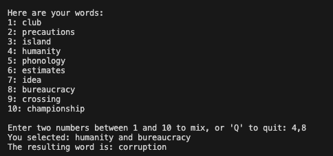

# WordMix

Welcome to the **WordMix**! This is a simple command-line game where you mix two words together by combining their word embeddings. The game uses pre-trained GloVe embeddings to find a word that is semantically closest to the combination of your chosen words.

## Table of Contents

- [WordMix](#wordmix)
  - [Table of Contents](#table-of-contents)
  - [Introduction](#introduction)
  - [Features](#features)
  - [Installation](#installation)
  - [How to Play](#how-to-play)
  - [Example](#example)
  - [Dependencies](#dependencies)
  - [Acknowledgments](#acknowledgments)

## Introduction

In this game, you'll be presented with a list of 10 random nouns. You select any two words by their numbers, and the game will "mix" them by adding their vector embeddings together. It then finds and displays the word whose embedding is closest to this new vector. It's a fun way to explore semantic relationships between words!

## Features

- Uses pre-trained GloVe word embeddings for semantic word representation.
- Randomly selects words from a dictionary of English nouns.
- Simple command-line interface.
- Educational tool to understand word embeddings and vector arithmetic.

## Installation

1. **Clone the Repository**

   ```bash
   git clone https://github.com/frrobledo/WordMix
   cd word-mixing-game
   ```

2. **Download GloVe Embeddings**

   - Download the pre-trained GloVe embeddings from the [GloVe website](https://nlp.stanford.edu/projects/glove/).
   - Specifically, download the `glove.6B.zip` file (~822 MB).
   - Extract the file and place `glove.6B.100d.txt` in the `word-mixing-game` directory.

3. **Create a Virtual Environment (Optional but Recommended)**

   ```bash
   python -m venv venv
   source venv/bin/activate  # On Windows, use `venv\Scripts\activate`
   ```

4. **Install Dependencies**

   ```bash
   pip install -r requirements.txt
   ```

   **Alternatively, install dependencies manually:**

   ```bash
   pip install numpy nltk scikit-learn
   ```

5. **Download NLTK Data Files**

   The script will attempt to download necessary NLTK data files on the first run. If you encounter issues, you can download them manually:

   ```python
   import nltk
   nltk.download('wordnet')
   nltk.download('omw-1.4')
   ```

## How to Play

1. **Run the Game**

   ```bash
   python word_mixing_game.py
   ```

2. **Gameplay**

   - The game will display 10 random words numbered from 1 to 10.
   - Enter two numbers corresponding to the words you want to mix.
   - The game will output the resulting word.
   - Enter `'Q'` or `'q'` at any time to quit the game.

## Example



## Dependencies

- Python 3.6 or higher
- NumPy
- NLTK
- scikit-learn
- GloVe Embeddings (`glove.6B.100d.txt`)


## Acknowledgments

- [GloVe: Global Vectors for Word Representation](https://nlp.stanford.edu/projects/glove/) by Stanford NLP Group.
- [NLTK: Natural Language Toolkit](https://www.nltk.org/)
